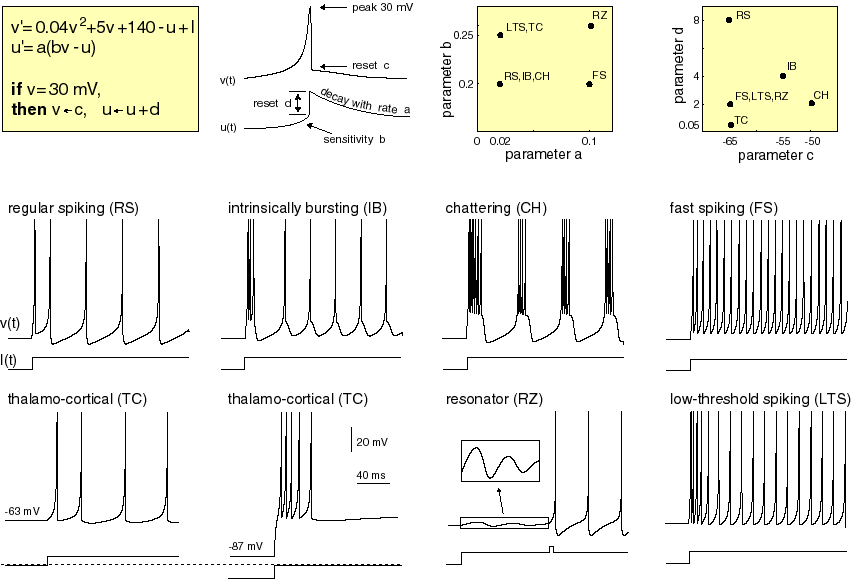
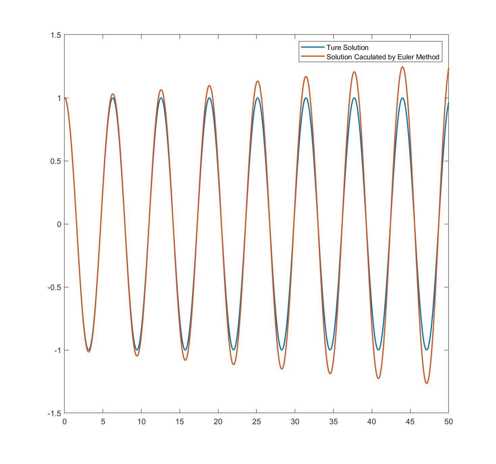
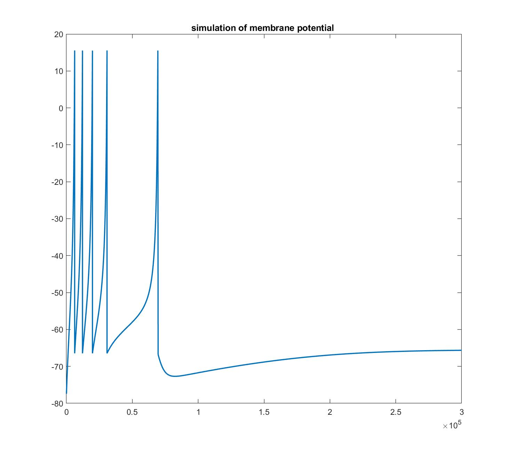
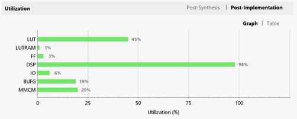
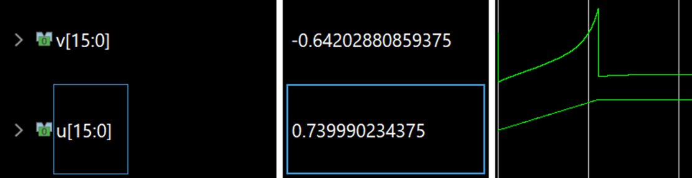
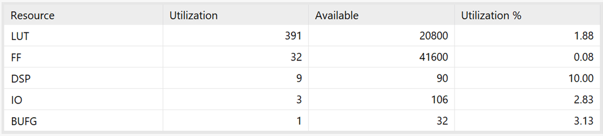
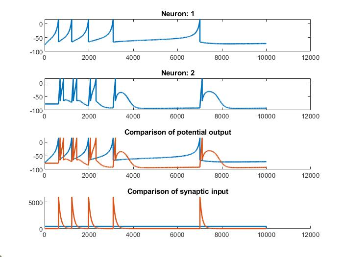
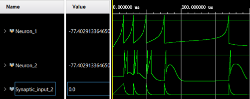
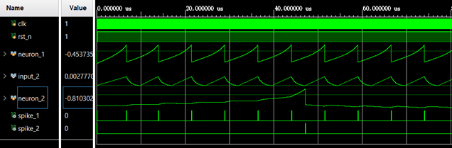
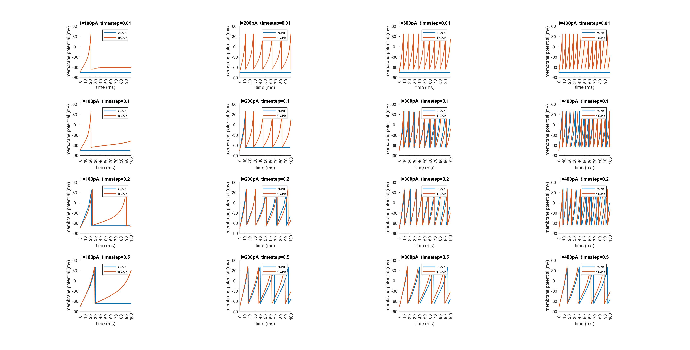

# IZ_Neuron_FPGA - In Progress
- [IZ\_Neuron\_FPGA - In Progress](#iz_neuron_fpga---in-progress)
  - [Introduction](#introduction)
  - [Izhikevich Model](#izhikevich-model)
  - [ODE Solution](#ode-solution)
  - [IZ Model Simulation Using MATLAB](#iz-model-simulation-using-matlab)
  - [IZ Model Implementation on FPGA](#iz-model-implementation-on-fpga)
  - [Synapse Simulation Using MATLAB](#synapse-simulation-using-matlab)
  - [Synapse Simulation on FPGA](#synapse-simulation-on-fpga)
  - [Impact of different precisions to the behavior of neurons](#impact-of-different-precisions-to-the-behavior-of-neurons)
## Introduction
FPGA implementation of Izhikevich Neuron Model for Neuromorphic Dynamic Networks.  
Research project of [ADAM Lab](https://adam.seas.gwu.edu/).
## [Izhikevich Model](https://www.izhikevich.org/publications/spikes.htm)  

9-parameter model is being used in our project:  
  $C\frac{dv}{dt} =k(v-v_r )(v-v_t )-(u-i)$  
  $\frac{du}{dt}=a[b(v-v_r )-u]$
## ODE Solution
Since the IZ Model is in ODE format, I'm using Euler Method to solve it.  
* Simulation result of using Euler Method to solve harmonic motion of a spring:  
  
## IZ Model Simulation Using MATLAB
Simulation was using parameters of DG cell from [Hippocampome](https://hippocampome.org/php/neuron_page.php?id=1000) with input current of 400 pA:  

## IZ Model Implementation on FPGA
Parameters of DG cell are being used in this part:  
* Using 64-bit float point IP Core:  
    * Simulation result of single cycle structure using Vivado:    
    
    * Simulation result of pipelined structure using Vivado:    
    
    * Pipeline structure and organized equation to fit the pipeline:  
    
    * Utilization on Artix-7:  
    
    * Use LEDs as output to see the spikes of neurons with different inputs:
    
* Using 16-bit fixed point ALU:  
    * Simulation result of single cycle structure using Vivado:
      
    * Utilization on Artix-7:  
    
## Synapse Simulation Using MATLAB
2 neurons connected by a synapse with weight of 3000:  
      
## Synapse Simulation on FPGA
* Using 64-bit float point IP Core:  
    
* Using 16-bit fixed point ALU:  
      
## Impact of different precisions to the behavior of neurons
  

